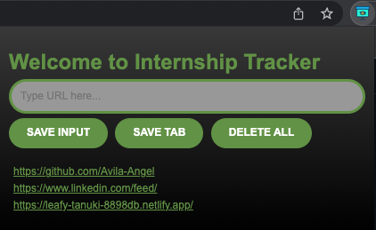

# Internship Tracker
A Chrome Extension
## Table of contents
* [General info](#general-info)
* [Technologies](#technologies)
* [Functionality](#functionality)
* [Screenshots](#screenshots)

## General info
Designed a chrome extension that helps students keep track of internship applications, leads that can potentially help with landing referrals, and other helpful links!

	
## Technologies
Project is created with:
* JavaScript
* HTML
* CSS

## Functionality
I used HTML and CSS to create the layout of the chrome extension. After creating the layout, I used JavaScript to create the necessary functions allowing users to save input written in the URL text field, save a current active tab, and delete all saved tabs. <b />

* URL text field - a functional menu button that has a dropdown menu that gives you the options to zoom in or zoom out when those buttons are pressed
* SAVE INPUT - a functional button that allows a user to save the text that was written in the URL text field and store it as a functional URL that can be visited at the users convinience 
* SAVE TAB - a button that interacts with the chrome.tab API to interact with the browser's tab system allowing the retreival and storage of the current active tab that the user is on
* DELETE ALL - a button that deletes all saved links when double clicked
	
## Screenshots

